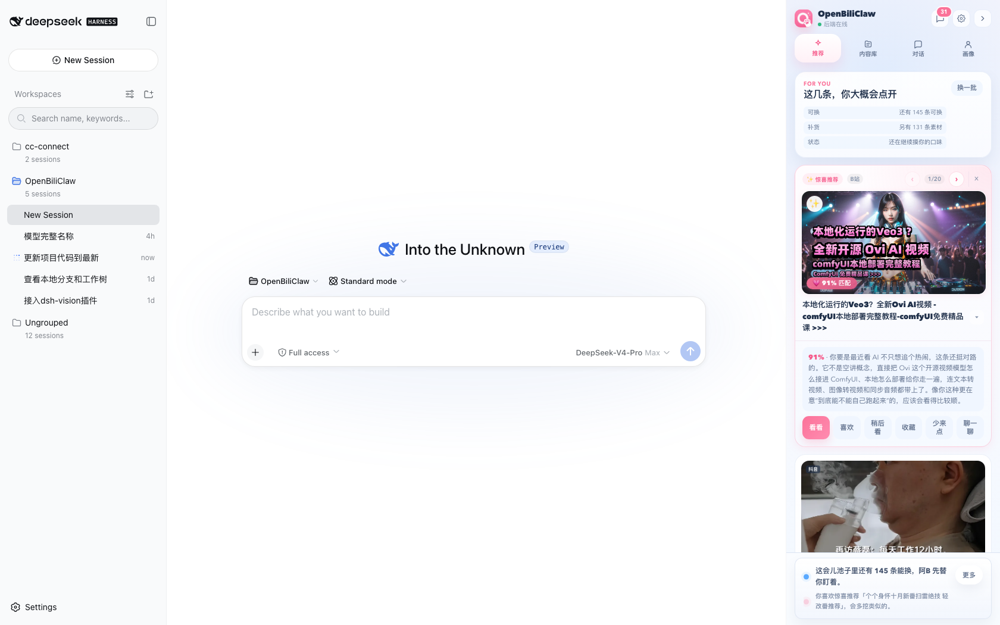
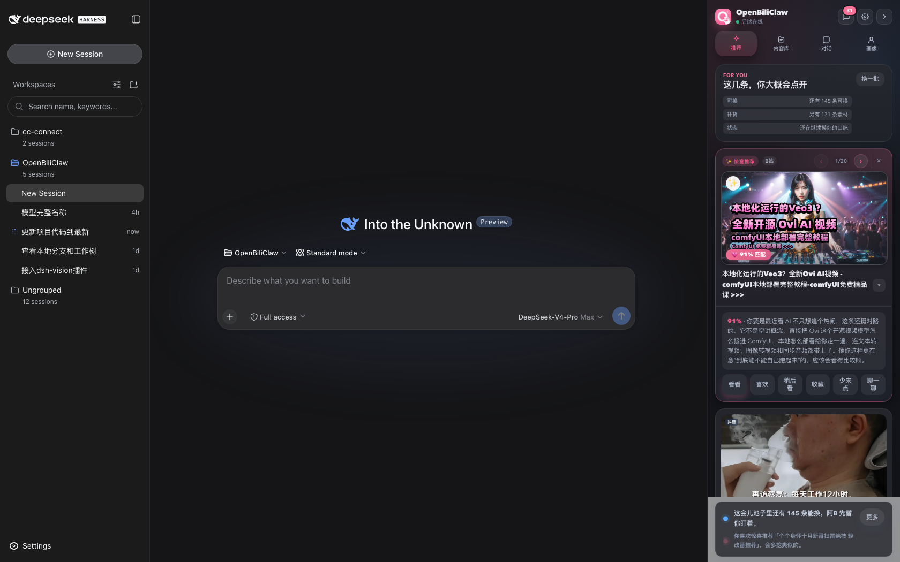
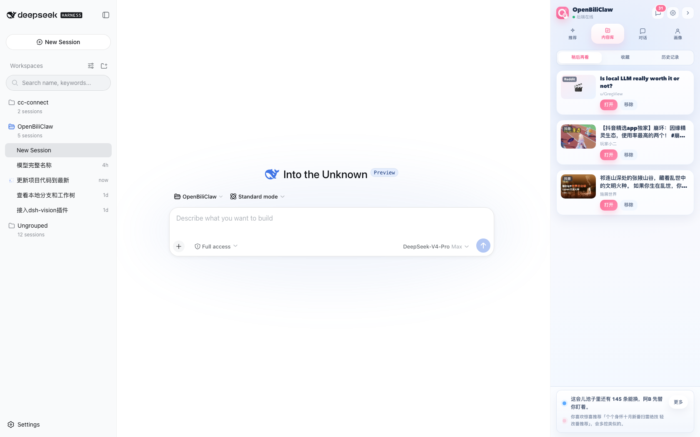
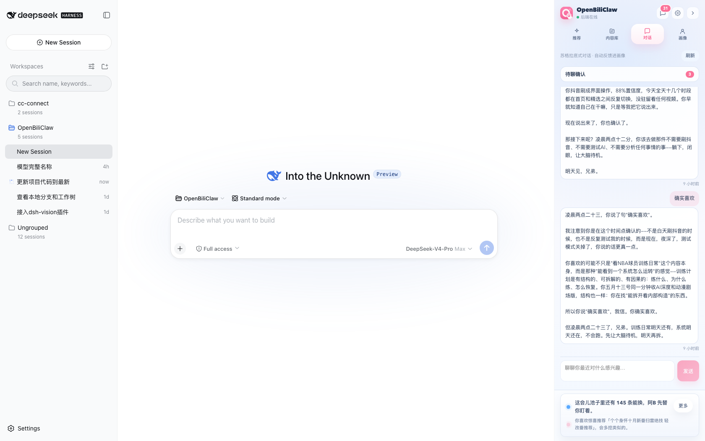
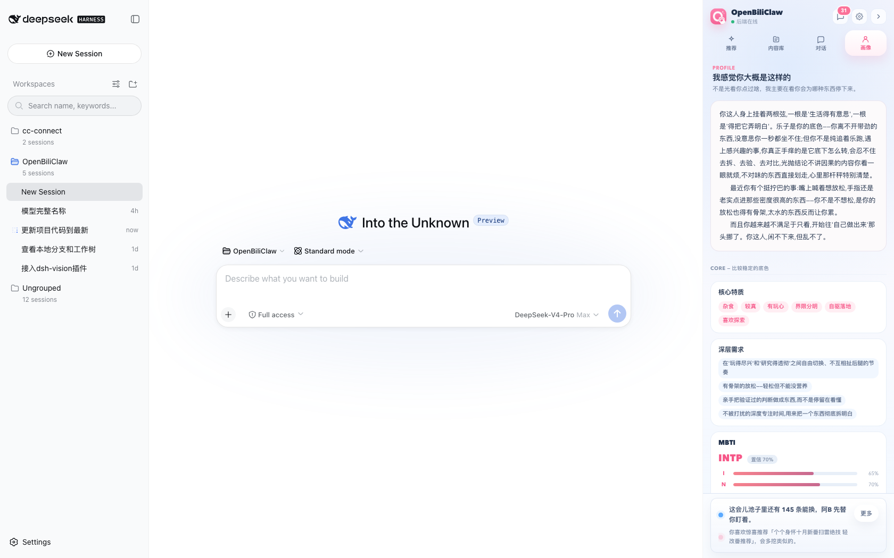
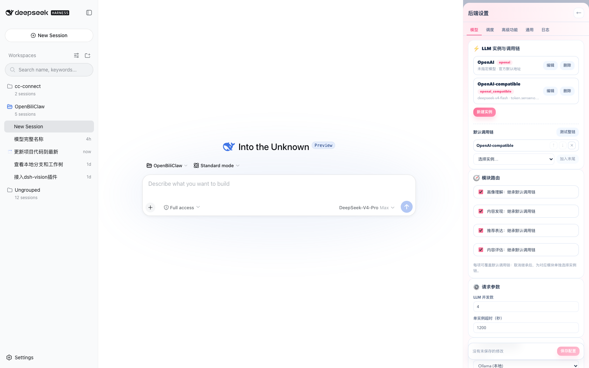
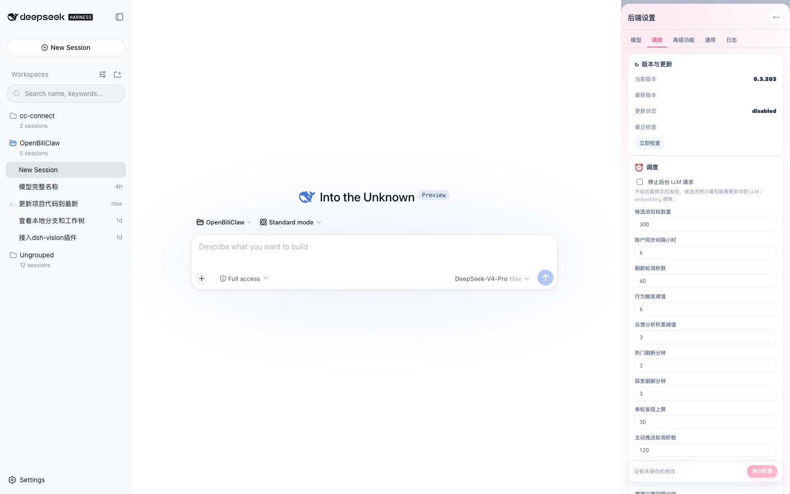
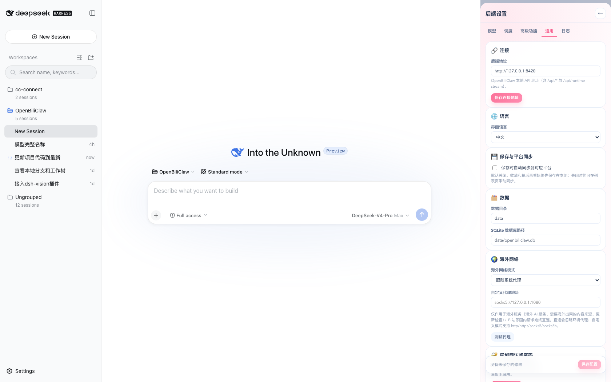

# 🦀 OpenBiliClaw · DSH 客户端插件

**OpenBiliClaw 是本地运行、跨平台、可调教的个性化内容推荐 Agent；本仓库是它的 DeepSeek Harness 客户端插件——DSH 左侧栏一个 OpenBiliClaw 按钮，点开右侧滑出抽屉（推荐/内容库/对话/画像/设置），并注册 22 个 Agent Bridge 工具，让 Agent 读推荐、答探测、闭环学习。**

[](LICENSE)
[](https://github.com/whiteguo233/OpenBiliClaw)

[English](#english) | 中文

---

## 这是什么

[OpenBiliClaw](https://github.com/whiteguo233/OpenBiliClaw) 是一个本地运行、跨平台、可调教的个性化内容推荐 Agent：从你在 B 站 / 小红书 / 抖音 / YouTube / X / 知乎 / Reddit / Linux.do / Bangumi / V2EX / 微博的使用、反馈与对话里持续深化你的心理画像，再主动去这些平台为你找内容。

本仓库是它的 **DeepSeek Harness（DSH）客户端插件**，把「消费侧」搬进 DSH 的 Web GUI：

- **人用侧**：在 DSH 左侧栏底部加一个 OpenBiliClaw 按钮，点开从右侧滑出一个与浏览器插件 / 手机版视觉一致的抽屉面板——推荐流、惊喜推荐、内容库、苏格拉底式对话、用户画像、后端设置，全部在 DSH 里点开即用；
- **Agent 用侧**：注册 22 个 `openbiliclaw_*` 工具（Agent Bridge v2 CLI）和 `openbiliclaw-adapter` skill，让 DSH 里的 Agent 能读取推荐、回答探测、保存内容、和用户对话，形成「推荐 → 反馈 → 画像 → 更准的推荐」的闭环。

典型场景：左边和 Agent 聊需求，点左下角的 OpenBiliClaw 按钮，右侧抽屉滑出来顺手刷两条推荐，点个「收藏」，过一会儿弹出兴趣探测，和它聊两句，画像就更懂你了——全程不离开 DSH。

> 边界说明：本插件只做**消费侧**。爬取 / 平台源管理 / 账号同步等能力仍属于主项目（后端 + 浏览器插件 / 手机版），有意不带入 DSH。

## 截图（真实使用场景）

| 推荐 · 亮色 | 推荐 · 深色（跟随 DSH 主题） |
|---|---|
|  |  |

| 内容库 | 对话 | 画像 |
|---|---|---|
|  |  |  |

| 设置 · 模型 | 设置 · 调度 | 设置 · 通用 |
|---|---|---|
|  |  |  |

## 功能

### 推荐（For You）
- **惊喜推荐 hero 大图**：整卡宽的 16:9 封面 + ✨ 角标 + 「💗 91% 匹配」分数胶囊，展开可见推荐理由、看看/喜欢/稍后看/收藏/少来点/聊一聊
- **跨平台封面兼容**：与浏览器插件 / PC Web 统一经后端 `/api/image-proxy` 加载，归一化小红书、YouTube 等 CDN URL；代理失败时自动回退为文本或媒体占位，不留空白卡片
- **无限滚动**：滚到底自动加载下一页；距离底部约 800px 时**提前预加载**；加载中显示底部转圈指示
- 换一批 / 追加一批 / 刷新；卡片内嵌喜欢/不感兴趣/评论反馈；底部动态流（探测、惊喜、保存事件）
- 未初始化时提供「开始初始化」入口，自动轮询初始化状态

### 内容库
- 稍后再看 / 收藏：打开、移除，与主项目共享同一份本地列表
- 顶部「同步到平台」：全量同步到 B 站收藏夹 / 稍后再看，轮询展示逐条结果（成功 / 失败 / 需登录）
- 每条可单独「同步 / 重试同步」；卡片内嵌 喜欢 / 不感兴趣 / 聊一聊，以及与另一列表的互切（收藏 ⇄ 稍后再看）
- 已同步（`synced` / `already_synced`）的条目自动从侧栏隐藏（数据保留）；空态区分「已全部同步」与「还没有收藏」
- 非 B 站平台条目标注同步状态（如「仅本地保存」），不误报为已同步
- 历史记录：近 30 天「点开过 / 看过 / 移除的」，光标分页 + 触底自动加载，带收藏/稍后/不再推荐等上下文徽章；「移除的」分类可一键恢复收藏 / 稍后再看

### 对话
- 苏格拉底式对话引擎：一问一答之间持续深化画像
- 兴趣 / 回避探测卡片：确认、拒绝、聊聊、稍后，乐观状态机即时反馈
- 待聊确认卡片：准 / 不准 / 聊聊，回复会带回被确认的原话上下文

### 画像
- 与 popup 同构的画像卡：MBTI、核心特质、深层需求、兴趣树、风格、洞察与觉察
- 新增「阿B 最近新记住了什么」认知卡，可展开影响/推理/依据，并支持加载更早的认知更新

### 设置（与浏览器插件后端设置页对齐）
- 模型：v2 实例模型（新建/编辑/删除实例、provider 条件字段、获取模型）、默认调用链（排序 + 测试整链）、模块路由（画像理解/内容发现/推荐表达/内容评估）、Embedding（含备选 provider + 测试）、LLM 并发/超时
- 调度：版本与更新（检查/应用）、全部调度参数、猜测兴趣参数
- 高级功能：P1 视觉画像 / P2 弹幕 / P3 关键帧、多模态处理、搜索词生成模式
- 通用：连接地址、语言、保存同步、数据目录、海外网络代理（带测试）、局域网访问密码、开机自启动、重新初始化
- 日志；全局「保存配置」栏 + 脏状态提示（未保存修改提醒）

### 面板体验
- **深色模式**跟随 DSH 主题实时切换（保留 OpenBiliClaw 自己的粉/蓝配色体系）
- 后端在线状态点带**迟滞**：连续两次探测失败才置离线，单次抖动不再闪
- 图标使用插件（浏览器扩展）原版图标：品牌 logo + 四个 tab 图标逐字节对齐

## 与主项目的关系

```
┌───────────────────────────── DSH Web GUI ─────────────────────────────┐
│  左边栏      │   会话区        │  详情栏     │                          │
│ (DSH 自带，   │  (DSH 自带)     │ (DSH 自带)  │   ← 右侧滑出 OpenBiliClaw │
│  底部含       │                 │            │      抽屉（推荐/内容库/  │
│  OpenBiliClaw │                 │            │      对话/画像/设置）    │
│  按钮)       │                 │            │                          │
└─────────────────────────────┬─────────────────────────────────────────┘
                              │ HTTP + WebSocket (默认 http://127.0.0.1:8420)
┌─────────────────────────────▼─────────────────────────────────────────┐
│              OpenBiliClaw 后端（主项目，同一份 config.toml / SQLite / 画像）│
└────────────────────────────────────────────────────────────────────────┘
                              ▲
DSH Agent（本插件注册的工具 + skill）── Agent Bridge v2 CLI ──┘
```

- 面板与 Agent 工具走**同一套后端状态**：面板里收藏的，Agent 工具立刻看得到；Agent 代答的探测，面板同步生效
- Agent Bridge 要求后端开启 Agent Bridge v2（`python -m openbiliclaw.integrations.openclaw.cli <command>`），插件默认通过 `<workdir>/.venv/bin/python` 调用
- 插件注册的 skill 读取 `<workdir>/skills/openbiliclaw-adapter/SKILL.md`（本仓库 `skills/openbiliclaw-adapter/SKILL.md` 附了同一份副本，方便对照）

## 插件组成

| 部分 | 说明 |
|---|---|
| `src/index.ts` + `src/tools.ts` | node 半：22 个 `openbiliclaw_*` 工具（bridge CLI，经 `ctx.shell` 执行器——新版 DSH 中 `bash` 更名为 `shell`）+ 注册 adapter skill |
| `src/skill.ts` | 解析 SKILL.md frontmatter 并注册为 DSH skill |
| `src/bridge.ts` | Agent Bridge v2 CLI 调用封装（超时 / 输出上限） |
| `src/client/*` | browser 半：左侧栏按钮（`sidebar.footer.action`）+ 右侧抽屉（`shell.overlay`）面板（React），含推荐/内容库/对话/画像/设置/消息抽屉、WebSocket 实时流、深色模式 |
| `lib/` | 构建产物（`lib/index.js` node 半 + `lib/client.js` 浏览器半），可直接安装 |

## 安装

### 前置

1. 一个可用的 [DeepSeek Harness](https://github.com/deepseek-ai/DeepSeek-Harness) 部署（含 Web GUI）
2. 一个运行中的 OpenBiliClaw 后端（主项目，开启 Agent Bridge v2，默认监听 127.0.0.1:8420）

插件要求 DSH `0.1.0-rc.6` 或更高版本；插件的 peer ABI 已与该版本的 `dsh-*` 包及 `@deepseek-ai/cordis ^4.0.1` 对齐。请不要在同一个 profile 中混用 `0.0.1` 时代的 DSH 工具包。

### 通过 DSH 插件 bundle 安装

本仓库声明了 `dsh.bundle`，因此可以作为完整插件包交给 `dsh plugin add` 或插件市场安装。bundle 会自动提供 `openbiliclaw` 配置行；安装后仍需按下面的配置说明，把 `workdir` 指向本地 OpenBiliClaw 主项目目录。

### 通过 npm/pnpm 安装（已发布版本）

```bash
npm install @openbiliclaw/dsh-plugin
# 或 pnpm add @openbiliclaw/dsh-plugin
```

安装后同样在 `cordis.patch.yml` 中增加 `openbiliclaw` 配置行（见下文）。

### 1. 界面槽位（当前 DSH 免配置）

面板渲染在两个**加法槽位**上，无需改 DSH 源码：

- **左侧按钮**：`sidebar.footer.action`（侧边栏底部、设置旁的附加动作）
- **右侧抽屉**：`shell.overlay`（帧级浮层，滑出在详情/文件/变更面板之上，不占用任何列）

两个槽位都是官方 DSH 自带的 `list` 槽（当前官方 DSH 已移除旧的 `aside` 列），此步直接跳过。

### 2. 安装插件包

把本仓库放进 web profile 的依赖目录并声明插件行：

```bash
cp -r <本仓库> ~/.dsh/profiles/<profile>/node_modules/@openbiliclaw/dsh-plugin
```

在 `~/.dsh/profiles/<profile>/cordis.patch.yml` 增加：

```yaml
# DSH 0.1.0-rc.6+: 新增配置行必须放在 insert 下
- insert:
    - id: openbiliclaw
      name: '@openbiliclaw/dsh-plugin'
      config:
        workdir: '/你的/OpenBiliClaw/项目目录'   # 后端项目根目录（含 .venv 与 skills/）
```

`cordis.patch.yml` 的顶层是 patch 列表；不带 `insert` 的 `id` 条目会被当作已有配置行覆盖，找不到 `openbiliclaw` 时会被跳过。

### 3. 重启

```bash
dsh web   # 重启 DSH Web 进程，刷新页面
```

面板内的「设置 → 通用 → 连接」可改后端地址（默认 `http://127.0.0.1:8420`，面板本地保存、立即生效；地址本身不要再附加 `/api`）。

### 配置项（cordis 行 config）

| 键 | 默认 | 说明 |
|---|---|---|
| `workdir` | （必填） | OpenBiliClaw 后端项目根目录；bridge CLI 与 SKILL.md 都从这里解析 |
| `pythonBin` | `<workdir>/.venv/bin/python` | 用于调用 bridge CLI 的 Python |
| `skillPath` | `<workdir>/skills/openbiliclaw-adapter/SKILL.md` | adapter skill 文件 |
| `timeoutMs` | `300000` | 单次 CLI 调用超时 |
| `stdoutMaxBytes` | `2000000` | CLI 输出上限 |

## 构建

构建需要 DSH 源码 checkout（类型与打包 preset 都从那里解析；本仓库不是 pnpm workspace 成员）：

```bash
tsc -p tsconfig.json                 # 先产出 lib/types
tsdown --env.DSH_BUILD_FACE client   # node 半 + 浏览器半（window.__ModuleLoader__ 闭包）
```

`tsdown.config.ts` 引用了 DSH checkout 的 `packages/client/tsdown.client.ts`（`clientBundle` preset），首次构建前把该路径改成你的 checkout。

## Agent 侧工具一览

`openbiliclaw_recommend` / `openbiliclaw_append_recommendations` / `openbiliclaw_reshuffle` / `openbiliclaw_get_delight` / `openbiliclaw_respond_delight` / `openbiliclaw_submit_feedback` / `openbiliclaw_get_activity_feed` / `openbiliclaw_chat` / `openbiliclaw_get_chat_history` / `openbiliclaw_next_probe` / `openbiliclaw_respond_interest_probe` / `openbiliclaw_next_avoidance_probe` / `openbiliclaw_respond_avoidance_probe` / `openbiliclaw_get_profile` / `openbiliclaw_get_profile_edit_state` / `openbiliclaw_edit_profile` / `openbiliclaw_list_saved` / `openbiliclaw_save_local` / `openbiliclaw_remove_saved` / `openbiliclaw_get_runtime_status` / `openbiliclaw_get_platform_availability` / `openbiliclaw_get_capabilities`

## 边界（有意不做）

- 平台源 / 爬取配置、源状态、池配比（这些属于主项目的「平台源」设置页）
- 同步到外部平台账号（本地收藏/稍后看始终本地优先，手动同步在主项目）
- 浏览器插件专属的设备配对、断开暂停等

## 相关链接

- 主项目：[OpenBiliClaw](https://github.com/whiteguo233/OpenBiliClaw) · [项目主页](https://whiteguo233.github.io/OpenBiliClaw/)
- DSH：[DeepSeek Harness](https://github.com/deepseek-ai/DeepSeek-Harness)

## License

[BSD-3-Clause](LICENSE)

## 友情链接

<details>
<summary>友情链接</summary>

[](https://linux.do/)

</details>

---

## English

A DeepSeek Harness (DSH) client plugin for [OpenBiliClaw](https://github.com/whiteguo233/OpenBiliClaw), the local-first cross-platform content-discovery agent. It adds a left-sidebar OpenBiliClaw button that opens a right-side drawer over the DSH web GUI (the `sidebar.footer.action` + `shell.overlay` seats) with the consumer side of OpenBiliClaw — recommendations with a hero delight banner, infinite scroll with prefetch, saved/history library, Socratic dialogue with interest/avoidance probes, the user profile card, and a settings surface aligned with the browser extension — and registers 22 `openbiliclaw_*` tools plus the `openbiliclaw-adapter` skill so DSH agents can drive the same backend in a closed loop. Cover images use the same backend image proxy as the browser and PC Web clients, with CDN URL normalization and a local fallback for failed loads. Crawling and source management intentionally stay in the main project. Requires DSH `0.1.0-rc.6` or newer (with the matching `dsh-*` ABI and `@deepseek-ai/cordis ^4.0.1`) plus a running OpenBiliClaw backend (Agent Bridge v2, default `http://127.0.0.1:8420`). When adding the plugin to `cordis.patch.yml`, wrap the row in a top-level `insert` entry; a bare `id` row is treated as an override and skipped when it does not already exist. See the Chinese section above for install, build and configuration details.
